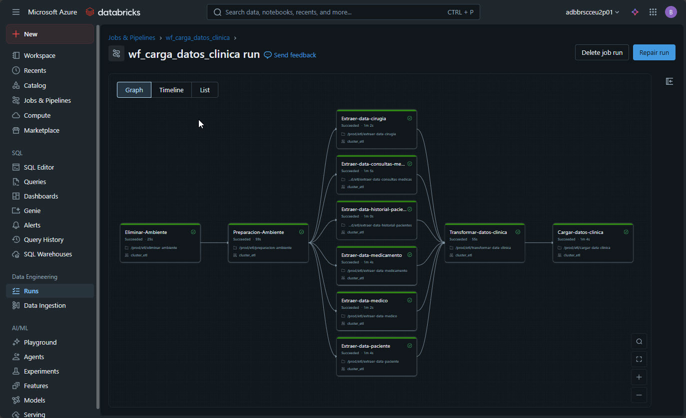

# 🏥 Project Gestión Clínica Databricks

Repositorio de ETL para la gestión de datos clínicos en **Databricks**. Este proyecto implementa un pipeline de datos completo usando la arquitectura **Medallion** (Bronze → Silver → Gold) para la ingesta, transformación y análisis de información clínica.

---

## 📋 Tabla de Contenidos

- [Descripción General](#descripción-general)
- [Objetivos del Proyecto](#objetivos-del-proyecto)
- [Arquitectura](#arquitectura)
- [Fuentes de Datos](#fuentes-de-datos)
- [Estructura del Proyecto](#estructura-del-proyecto)
- [Capas de Datos](#capas-de-datos)
- [Flujo del ETL](#flujo-del-etl)
- [Requisitos Previos](#requisitos-previos)
- [Guía de Ejecución](#guía-de-ejecución)
- [Workflow Automatizado (CI/CD)](#-workflow-automatizado-cicd)
- [Descripción de Tablas](#descripción-de-tablas)
- [Notas Técnicas](#notas-técnicas)
- [Contacto](#contacto)

---

## 📝 Descripción General

Este proyecto implementa un sistema completo de extracción, transformación y carga (**ETL**) de datos clínicos en **Databricks**. Utiliza la arquitectura **Medallion** para organizar los datos en diferentes capas de calidad y complejidad, permitiendo análisis avanzados sobre información de pacientes, médicos, medicamentos, cirugías y consultas médicas.

El proyecto está diseñado para:
- Ingerir datos desde múltiples fuentes (Data Lake, CosmosDB)
- Transformar y limpiar datos en formato tabular
- Crear vistas analíticas optimizadas para reportes y análisis

---

## 🎯 Objetivos del Proyecto

1. **Automatizar la ingesta** de datos clínicos desde fuentes heterogéneas
2. **Normalizar y limpiar** datos para asegurar calidad
3. **Crear una estructural medallion** clara para gobernanza de datos
4. **Proporcionar vistas analíticas** (capa Gold) para reportes y BI
5. **Implementar trazabilidad** de datos mediante timestamps y auditoría

---

## 🏗️ Arquitectura


---

## 📊 Fuentes de Datos

El proyecto integra datos de las siguientes fuentes:

### 1. **Data Lake (Azure Blob Storage)**
- **Ubicación**: `dtlkbrscceu2d01` container `raw`
- **Formato**: CSV
- **Archivos**:
  - `paciente.csv` - Información demográfica de pacientes
  - `medico.csv` - Datos de médicos y especialidades
  - `medicamento.csv` - Catálogo de medicamentos
  - `cirugia.csv` - Procedimientos quirúrgicos disponibles
  - `consultas_medicas.csv` - Registros de consultas

### 2. **CosmosDB**
- **Ubicación**: `cosmosdb/` en datasets
- **Formato**: JSON
- **Archivo**:
  - `historial_pacientes.json` - Historial médico completo de pacientes

### 3. **Metastore Databricks**
- **Storage Account**: `adlsbrscceu2d01`
- **Container**: `unit-catalog-clinica`

---

## 📂 Estructura del Proyecto

```
project-gestion-clinica-databricks/
│
├── README.md                          # Este archivo
│
├── .github/                           # Configuración de CI/CD
│   └── workflows/
│       └── deploy-notebook.yml        # Workflow de despliegue automático
│
├── assets/                            # Recursos multimedia
│   ├── diagrama_proyecto_etl_clinica_final.png
│   └── ejecucion_wf_carga_datos_clinica.jpg
│
├── datasets/                          # Datos de entrada
│   ├── cosmosdb/
│   │   └── historial_pacientes.json   # Historial en formato JSON
│   └── datalake/
│       ├── paciente.csv
│       ├── medico.csv
│       ├── medicamento.csv
│       ├── cirugia.csv
│       └── consultas_medicas.csv
│
├── preparacion-ambiente/              # Configuración inicial
│   └── preparacion-ambiente.sql       # Script de creación de catálogo y tablas
│
├── proceso/                           # Scripts del ETL
│   ├── 📥 EXTRACCIÓN (Ingestión)
│   │   ├── extraer-data-paciente.py
│   │   ├── extraer-data-medico.py
│   │   ├── extraer-data-medicamento.py
│   │   ├── extraer-data-cirugia.py
│   │   ├── extraer-data-consultas-medicas.py
│   │   └── extraer-data-historial-pacientes.py
│   │
│   ├── 🔄 TRANSFORMACIÓN
│   │   ├── transformar-data-clinica.py # Transformaciones Bronze → Silver
│   │   └── Preparacion_Ambiente.sql    # Setup de ambiente
│   │
│   └── 📤 CARGA
│       └── cargar-data-clinica.py     # Carga a capa Silver y Gold
│
└── reversion/                         # Scripts de revertir cambios
    └── eliminar-medallion.sql         # Elimina estructura completa
```

---

## 🔄 Capas de Datos

### **CAPA BRONZE** (Raw - Ingesta)

Replica exacta de los datos de las fuentes sin transformación.

| Tabla | Fuente | Descripción |
|-------|--------|-------------|
| `catalogo_clinica.bronze.paciente` | paciente.csv | Información demográfica de pacientes |
| `catalogo_clinica.bronze.medico` | medico.csv | Datos de profesionales médicos |
| `catalogo_clinica.bronze.medicamento` | medicamento.csv | Catálogo de medicamentos |
| `catalogo_clinica.bronze.cirugia` | cirugia.csv | Procedimientos quirúrgicos |
| `catalogo_clinica.bronze.consultas_medicas` | consultas_medicas.csv | Registros de consultas |
| `catalogo_clinica.bronze.historial_pacientes` | historial_pacientes.json | Historial médico de pacientes |

**Características**:
- Formato Delta Lake
- Sin transformación de datos
- Incluye timestamps de carga

---

### **CAPA SILVER** (Cleaned - Transformación)

Datos normalizados, validados y sin duplicados.

| Tabla | Origen | Descripción |
|-------|--------|-------------|
| `catalogo_clinica.silver.paciente` | bronze.paciente | Pacientes normalizados |
| `catalogo_clinica.silver.medico` | bronze.medico | Médicos normalizados |
| `catalogo_clinica.silver.medicamento` | bronze.medicamento | Medicamentos normalizados |
| `catalogo_clinica.silver.cirugia` | bronze.cirugia | Cirugías normalizadas |
| `catalogo_clinica.silver.consultas_medicas` | bronze.consultas_medicas | Consultas normalizadas |
| `catalogo_clinica.silver.historial_pacientes_medicamentos` | bronze.historial_pacientes | Historial de medicamentos por paciente |
| `catalogo_clinica.silver.historial_pacientes_cirugias` | bronze.historial_pacientes | Historial de cirugías por paciente |

**Transformaciones aplicadas**:
- ✅ Limpieza de datos nulos y duplicados
- ✅ Normalización de formato de strings (trim, case)
- ✅ Validación de tipos de datos
- ✅ Desnormalización de arrays JSON
- ✅ Adición de timestamps de procesamiento

---

### **CAPA GOLD** (Curated - Análisis)

Tablas optimizadas para reportes, dashboards y análisis.

| Tabla | Descripción | Uso |
|-------|-------------|-----|
| `catalogo_clinica.gold.paciente_perfil_clinico` | Perfil consolidado de pacientes con historial clínico | BI / Dashboards |
| `catalogo_clinica.gold.consulta_por_medico` | Análisis de consultas por médico y especialidad | Reportes médicos |
| `catalogo_clinica.gold.ingresos_por_especialidad` | Ingresos agregados por especialidad médica | Análisis financiero |
| `catalogo_clinica.gold.medicamentos_consumo` | Consumo y disponibilidad de medicamentos | Inventario |

**Características**:
- Datos desnormalizados para acceso rápido
- Agregaciones y KPIs calculados
- Optimizados para consultas BI
- Índices y partición según necesidad

---

## 🔀 Flujo del ETL

```
PASO 1: PREPARACIÓN DEL AMBIENTE (1 vez)
   └─► Run: preparacion-ambiente/preparacion-ambiente.sql
       ✓ Crea catálogo "catalogo_clinica"
       ✓ Crea esquemas: bronze, silver, gold
       ✓ Crea tablas vacías en capa bronze
       ✓ Configura ubicaciones externas

PASO 2: EXTRACCIÓN - BRONZE (Ingesta Raw)
   ├─► Run: proceso/extraer-data-paciente.py
   ├─► Run: proceso/extraer-data-medico.py
   ├─► Run: proceso/extraer-data-medicamento.py
   ├─► Run: proceso/extraer-data-cirugia.py
   ├─► Run: proceso/extraer-data-consultas-medicas.py
   └─► Run: proceso/extraer-data-historial-pacientes.py
       ✓ Lee archivos desde Data Lake y CosmosDB
       ✓ Carga datos en tablas bronze.* sin transformación
       ✓ Registra timestamp de carga

PASO 3: TRANSFORMACIÓN - SILVER (Limpieza)
   └─► Run: proceso/transformar-data-clinica.py
       ✓ Lee datos de tablas bronze.*
       ✓ Limpia, normaliza y valida
       ✓ Carga en tablas silver.*
       ✓ Desnormaliza arrays JSON

PASO 4: CARGA - GOLD (Agregación Analítica)
   └─► Run: proceso/cargar-data-clinica.py
       ✓ Lee datos de tablas silver.*
       ✓ Crea agregaciones y KPIs
       ✓ Carga en tablas gold.*
       ✓ Genera vistas analíticas

RESULTADO:
   ✅ Datos BI-Ready en capa Gold
   ✅ Trazabilidad completa
   ✅ Calidad garantizada
```

---

## 📋 Requisitos Previos

### Infraestructura
- ✅ Workspace de **Databricks** activo
- ✅ Acceso a **Azure Data Lake Storage** (ADLS)
- ✅ Acceso a **CosmosDB** (si aplica)
- ✅ **SQL Warehouse** o **All-Purpose Cluster** en Databricks
- ✅ Permisos de lectura/escritura en storage

### Configuración
- 📋 **Catálogo**: `catalogo_clinica`
- 📋 **Esquemas**: `bronze`, `silver`, `gold`
- 📋 **Storage**: Configurar credenciales en Databricks

### Datos
- 📁 Archivos CSV en Data Lake
- 📄 JSON de historial en CosmosDB

---

## 🚀 Guía de Ejecución

### Opción 1: Ejecución Manual en Databricks

#### 1️⃣ **Preparar el Ambiente (Ejecutar 1 vez)**
```sql
-- Abrir: preparacion-ambiente/preparacion-ambiente.sql
-- Click "Run All"
-- Esperar a que se completen todas las celdas
```

#### 2️⃣ **Ejecutar Extracción (Bronze)**
```python
# En secuencia:
# 1. Run: extraer-data-paciente.py
# 2. Run: extraer-data-medico.py
# 3. Run: extraer-data-medicamento.py
# 4. Run: extraer-data-cirugia.py
# 5. Run: extraer-data-consultas-medicas.py
# 6. Run: extraer-data-historial-pacientes.py

# Cada notebook debe completarse antes de ejecutar el siguiente
```

#### 3️⃣ **Ejecutar Transformación (Silver)**
```python
# Run: transformar-data-clinica.py
# Esperar a que se completen todas las transformaciones
```

#### 4️⃣ **Ejecutar Carga (Gold)**
```python
# Run: cargar-data-clinica.py
```

### Opción 2: Ejecución mediante Jobs en Databricks

1. Crear **Job** con tareas secuenciales
2. Agregar tareas en siguiente orden:
   - preparacion-ambiente.sql
   - 6 notebooks de extracción
   - transformar-data-clinica.py
   - cargar-data-clinica.py
3. Configurar notificaciones de estado
4. Agendar ejecución según necesidad

---

## 🔄 Workflow Automatizado (CI/CD)

Este proyecto cuenta con un workflow automatizado de despliegue continuo mediante **GitHub Actions** que despliega y ejecuta el pipeline ETL completo en Databricks.

### 📊 Workflow: `wf_carga_datos_clinica`

El workflow está configurado para ejecutarse automáticamente al hacer push a la rama `main` y orquesta todas las tareas del ETL en secuencia.

#### Configuración del Workflow

| Propiedad | Valor |
|-----------|-------|
| **Nombre** | `wf_carga_datos_clinica` |
| **Formato** | MULTI_TASK |
| **Cluster** | `cluster_etl` (existente) |
| **Timeout** | 7200 segundos (2 horas) |
| **Max Concurrent Runs** | 1 |
| **Schedule** | `0 0 8 * * ?` (8:00 AM diario) - PAUSED |
| **Ubicación Notebooks** | `/prod/etl/` |

#### Tareas del Workflow

El workflow ejecuta las siguientes tareas en secuencia:

**1. Eliminar-Ambiente**
   - **Notebook**: `eliminar-ambiente.sql`
   - **Descripción**: Limpia el ambiente previo
   - **Timeout**: 3600s | **Retries**: 2
   - **Parámetros**:
     - `nombre_container`: "unit-catalog-clinica"
     - `nombre_storage`: "adlsbrscceu2d01"
     - `catalogo`: "catalogo_clinica"

**2. Preparacion-Ambiente** ⬅️ *Depende de: Eliminar-Ambiente*
   - **Notebook**: `preparacion-ambiente.sql`
   - **Descripción**: Crea catálogo, esquemas y tablas
   - **Timeout**: 3600s | **Retries**: 2
   - **Parámetros**:
     - `catalogo`: "catalogo_clinica"
     - `nombre_container`: "unit-catalog-clinica"
     - `nombre_storage`: "adlsbrscceu2d01"
     - `nombre_container_raw`: "raw"
     - `nombre_storage_raw`: "dtlkbrscceu2d01"

**3. Extracción de Datos (6 tareas en paralelo)** ⬅️ *Depende de: Preparacion-Ambiente*

   **3.1. Extraer-data-cirugia**
   - **Notebook**: `extraer-data-cirugia.py`
   - **Timeout**: 3600s | **Retries**: 2
   - **Parámetros**:
     - `catalogo`: "catalogo_clinica"
     - `raw_datalake`: "dtlkbrscceu2d01"
     - `raw_container`: "raw"
     - `raw_file`: "cirugia.csv"
     - `bronze_schema`: "bronze"
     - `bronze_table`: "cirugia"

   **3.2. Extraer-data-consultas-medicas**
   - **Notebook**: `extraer-data-consultas-medicas.py`
   - **Timeout**: 3600s | **Retries**: 2
   - **Parámetros**:
     - `catalogo`: "catalogo_clinica"
     - `raw_datalake`: "dtlkbrscceu2d01"
     - `raw_container`: "raw"
     - `raw_file`: "consultas_medicas.csv"
     - `bronze_schema`: "bronze"
     - `bronze_table`: "consultas_medicas"

   **3.3. Extraer-data-medicamento**
   - **Notebook**: `extraer-data-medicamento.py`
   - **Timeout**: 3600s | **Retries**: 2
   - **Parámetros**:
     - `catalogo`: "catalogo_clinica"
     - `raw_datalake`: "dtlkbrscceu2d01"
     - `raw_container`: "raw"
     - `raw_file`: "medicamento.csv"
     - `bronze_schema`: "bronze"
     - `bronze_table`: "medicamento"

   **3.4. Extraer-data-medico**
   - **Notebook**: `extraer-data-medico.py`
   - **Timeout**: 3600s | **Retries**: 2
   - **Parámetros**:
     - `catalogo`: "catalogo_clinica"
     - `raw_datalake`: "dtlkbrscceu2d01"
     - `raw_container`: "raw"
     - `raw_file`: "medico.csv"
     - `bronze_schema`: "bronze"
     - `bronze_table`: "medico"

   **3.5. Extraer-data-paciente**
   - **Notebook**: `extraer-data-paciente.py`
   - **Timeout**: 3600s | **Retries**: 2
   - **Parámetros**:
     - `catalogo`: "catalogo_clinica"
     - `raw_datalake`: "dtlkbrscceu2d01"
     - `raw_container`: "raw"
     - `raw_file`: "paciente.csv"
     - `bronze_schema`: "bronze"
     - `bronze_table`: "paciente"

   **3.6. Extraer-data-historial-pacientes**
   - **Notebook**: `extraer-data-historial-pacientes.py`
   - **Timeout**: 3600s | **Retries**: 2
   - **Parámetros**:
     - `catalogo`: "catalogo_clinica"
     - `cosmos_account`: "codbbrscceu2d01"
     - `cosmos_scope`: "accessScopeforCosmosDB"
     - `cosmos_secret`: "cosmosdbKey"
     - `cosmos_database`: "clinica"
     - `cosmos_container`: "raw"
     - `bronze_schema`: "bronze"
     - `bronze_table`: "historial_pacientes"

**4. Transformar-datos-clinica** ⬅️ *Depende de: Todas las 6 tareas de extracción*
   - **Notebook**: `transformar-data-clinica.py`
   - **Descripción**: Transforma datos Bronze → Silver
   - **Timeout**: 3600s | **Retries**: 2
   - **Parámetros**:
     - `catalogo`: "catalogo_clinica"
     - `bronze_schema`: "bronze"
     - `bronze_pacientes`: "paciente"
     - `bronze_medicos`: "medico"
     - `bronze_medicamentos`: "medicamento"
     - `bronze_cirugias`: "cirugia"
     - `bronze_consultas_medicas`: "consultas_medicas"
     - `bronze_historial_paciente`: "historial_pacientes"
     - `silver_schema`: "silver"
     - `silver_pacientes`: "paciente"
     - `silver_medicos`: "medico"
     - `silver_medicamentos`: "medicamento"
     - `silver_cirugias`: "cirugia"
     - `silver_consultas_medicas`: "consultas_medicas"
     - `silver_historial_pacientes_medicamentos`: "historial_pacientes_medicamentos"
     - `silver_historial_pacientes_cirugias`: "historial_pacientes_cirugias"

**5. Cargar-datos-clinica** ⬅️ *Depende de: Transformar-datos-clinica*
   - **Notebook**: `cargar-data-clinica.py`
   - **Descripción**: Carga datos Silver → Gold
   - **Timeout**: 3600s | **Retries**: 2
   - **Parámetros**:
     - `catalogo`: "catalogo_clinica"
     - `silver_schema`: "silver"
     - `silver_hist_pac_med_table`: "historial_pacientes_medicamentos"
     - `silver_hist_pac_cir_table`: "historial_pacientes_cirugias"
     - `silver_paciente_table`: "paciente"
     - `silver_medico_table`: "medico"
     - `silver_consultas_medicas_table`: "consultas_medicas"
     - `silver_medicamento_table`: "medicamento"
     - `silver_cirugia_table`: "cirugia"
     - `gold_schema`: "gold"
     - `gold_pac_per_cli_table`: "paciente_perfil_clinico"
     - `gold_consulta_por_medico_table`: "consulta_por_medico"
     - `gold_ingreso_por_especialidad_table`: "ingresos_por_especialidad"
     - `gold_medicamentos_consumo_table`: "medicamentos_consumo"

#### Ejecución del Workflow



#### Características del Deployment

- ✅ **Despliegue automático** de notebooks al workspace de producción
- ✅ **Validación de configuración** antes de ejecutar
- ✅ **Monitoreo en tiempo real** del estado de ejecución
- ✅ **Reutilización de cluster** existente para optimizar costos
- ✅ **Notificaciones por email** en caso de fallo
- ✅ **Tags de ambiente**: `environment:production`, `project:gestion-clinica`, `cluster_used:cluster_etl`

#### Estado y Monitoreo

El workflow puede ser monitoreado desde:
- **GitHub Actions**: Ver logs de despliegue
- **Databricks UI**: Ver ejecución del job y estado de tareas
- **API Databricks**: Consultar estado programáticamente

## 📊 Descripción de Tablas

### BRONZE

#### `bronze.paciente`
```
Columnas:
- identificacion (INT) - PK
- nombre (STRING)
- apellido (STRING)
- fecha_nacimiento (DATE)
- genero (STRING)
- email (STRING)
- telefono (STRING)
- ciudad (STRING)
- pais (STRING)
- tipo_sangre (STRING)
```

#### `bronze.medico`
```
Columnas:
- id_medico (STRING) - PK
- nombre (STRING)
- apellido (STRING)
- especialidad (STRING)
- numero_licencia (STRING)
- hospital (STRING)
- ciudad (STRING)
- telefono (STRING)
- email (STRING)
- estado (STRING)
```

#### `bronze.medicamento`
```
Columnas:
- codigo_medicamento (STRING) - PK
- nombre_medicamento (STRING)
- principio_activo (STRING)
- dosis (INT)
- unidad (STRING)
- especialidad (STRING)
- fabricante (STRING)
- precio_unitario (INT)
- estado (STRING)
```

#### `bronze.cirugia`
```
Columnas:
- codigo_cirugia (STRING) - PK
- nombre_cirugia (STRING)
- especialidad (STRING)
- duracion_promedio_minutos (INT)
- complejidad (STRING)
- costo_base (INT)
- riesgo_nivel (STRING)
- estado (STRING)
```

#### `bronze.consultas_medicas`
```
Columnas:
- codigo_consulta (STRING) - PK
- id_paciente (INT) - FK
- fecha_consulta (DATE)
- id_medico (STRING) - FK
- especialidad (STRING)
- motivo (STRING)
- diagnostico (STRING)
- costo_consulta (INT)
- estado (STRING)
```

---

## 🔧 Notas Técnicas

### **Librerías Utilizadas**

```python
# Spark SQL
from pyspark.sql.functions import (
    count, current_timestamp, coalesce, lit, col, sum, avg, 
    countDistinct, round, collect_set, max, greatest,
    explode_outer, trim, upper, lower
)

# Tipos de datos
from pyspark.sql.types import (
    StructType, StructField, StringType, IntegerType, DateType,
    ArrayType
)
```

### **Delta Lake Features**

- **ACID Transactions** para garantizar consistencia
- **Time Travel** para acceder versiones históricas
- **Schema Enforcement** para validar estructura
- **Unified Batch & Streaming** (preparado para futuras mejoras)

### **Optimizaciones**

- Particionamiento por fecha en tablas grandes
- Z-Order clustering en campos frecuentes
- Compactación automática de archivos pequeños
- Vacío de snapshots antiguos

### **Control de Calidad**

- Timestamps de carga en cada tabla
- Conteo de registros en cada proceso
- Validación de valores NULL
- Detección de duplicados

---

## 🔄 Flujo de Reversión

En caso de necesidad, ejecutar scripts de limpieza:

### Eliminar Estructura Completa
```sql
Run: reversion/eliminar-medallion.sql
-- Elimina catálogo y todas las tablas
-- Regresa a estado inicial
```

---

**Última actualización**: Febrero 2026  
**Versión**: 1.0.0  
**Status**: Producción ✅
